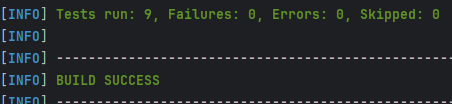
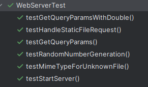
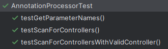
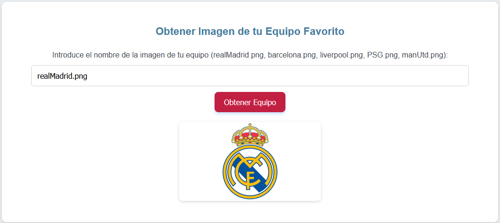
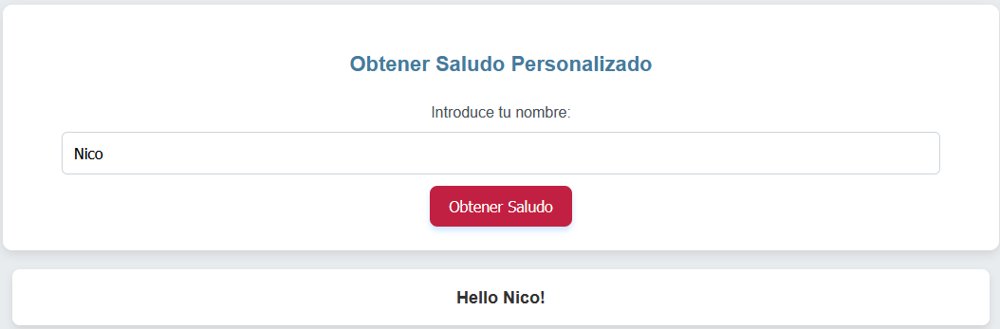
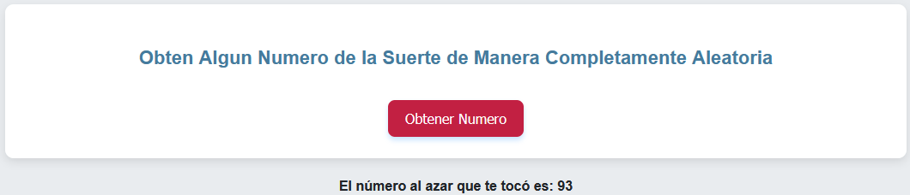

# Servidor Web hecho en Java

Este proyecto tiene como objetivo el desarrollo de un servidor web en Java, similar a Apache, capaz de entregar páginas HTML e imágenes en formato PNG. Además, el servidor incluirá un framework IoC (Inversión de Control) que permitirá la construcción de aplicaciones web a partir de POJOs (Plain Old Java Objects).

Como parte de la implementación, se desarrollará una aplicación web de ejemplo utilizando el servidor. El servidor será capaz de atender múltiples solicitudes de manera no concurrente.

Para demostrar las capacidades reflexivas de Java, se implementará un prototipo mínimo que permita la carga dinámica de un bean (POJO) y la generación de una aplicación web basada en él.

## Autor

* **Nicolas Bernal** - Autor y Desarrollador del Proyecto

### Guia Para Instalar y Ejecutar el Proyecto con DockerCompose

Lo primero que debes hacer es clonar este repositorio y navegar al directorio donde lo clonaste:

```
git clone https://github.com/NicoBernal19/Taller4AREP.git
```

Luego navega hacia el directorio donde hayas cloneado el proyecto.

Construye y tambien compila el proyecto con Maven:

```
mvn clean install
```

A continuacion ejecuta el archivo docker-compose.yml:

```
docker compose up --build
```

El servidor esta hecho para que inicie en el puerto `36000`, una vez ejecutado, ya esta listo para que puedas usarlo y probarlo todo lo que desees. La pagina inicial es la siguiente:

```
http://localhost:36000/index.html
```

## Funcionalidades del servidor

El código está estructurado en diferentes archivos para no tener una sola clase llena de codigo, ademas de que es una buena practica y permite que todo este mas ordenado y compacto, hace que sea mas facil extender a posterior el codigo. Tambien organize los controladores y anotaciones en paquetes distintos para que este todo mas organizado.

Entre las funcionalidades que se ofrecen encontramos las siguientes:

- Permite servir HTML, CSS, JS e imágenes.
- Hace uso de las capacidades reflexivas de JAVA

## Pruebas

### Pruebas Unitarias

Para poder ejecutar las pruebas con las que cuenta este proyecto ejecuta el siguiente comando:

```
mvn test
```

A continuacion se encuentran imagenes de la ejecucion de las pruebas:







### Pruebas en tiempo real

Puedes abrir tu navegador y acceder al siguiente enlace, para poder explorar y probar la aplicacion web:

```
http://localhost:36000/index.html
```

Una vez abierto el servidor web puedes navegar la pagina, probando las distintas funcionalidades. A continuacion encontramos algunos ejemplos de acciones que se pueden hacer:







Por otro lado, puedes dirigirte al siguiente enlace (o uno similar) para probar la funcionalidad del saludo personalizado con tu nombre:

```
http://localhost:36000/hello?name=nicolas
```

Si prefieres tambien puedes dirigirte a los demas endpoints disponibles para darles un vistazo:

```
http://localhost:36000/random?min=1&max=18 (Puedes cambiar los parametros a tu gusto)
http://localhost:36000/greeting
http://localhost:36000/later
http://localhost:36000/pi
http://localhost:36000/e
```

### Pruebas archivos estáticos

Finalmente, tambien puedes probar a acceder a los archivos estaticos con los que cuenta el proyecto:

```
http://localhost:36000/script.js
http://localhost:36000/styles.css
http://localhost:36000/images/realMadrid.png
```

### Trabajo Realizado con Docker

Primero se debe crear la imagen:

```
docker build -t dockerwebapp .
```

Luego creamos el contenedor con esa imagen que ya tenemos:

```
docker run -d -p 34000:6000 --name firstdockercontainer dockerwebapp
```
En este caso correria por el puerto 34000.


Asi es como quedo en DockerDesktop:


Por ultimo, lo vamos a subir a un repositorio que vamos a crear en dockerHub:


Con esto ya vamos a poder descargar y ejecutar la imagen facilmente:

```
tag dockerwebapp nicobernal19/firstdockerrepo
docker push nicobernal19/firstdockerrepo:latest
```

### Despliegue en AWS

Debemos crear una instancia en AWS. Una vez ya tengamos esto vamos a acceder a la maquina virtual, para hacerlo yo use PuTTy.


Dentro de la maquina virtual vamos a instalar docker y luego debemos iniciar el servici:


A partir de la imagen que subimos a nuestro repositorio de DockerHub vamos a crear un contenedor:


En este caso el servidor desplegado en AWS va a correr por el puerto 37000.

Si es necesario (en mi caso lo fue) debemos ir al security group de la instancia de AWS que estamos utilizando y debemos ajustar las reglas de entrada para que permita navegar correctamente por el servidor.


Ya quedo desplegado correctamente:


### Video Explicatorio


